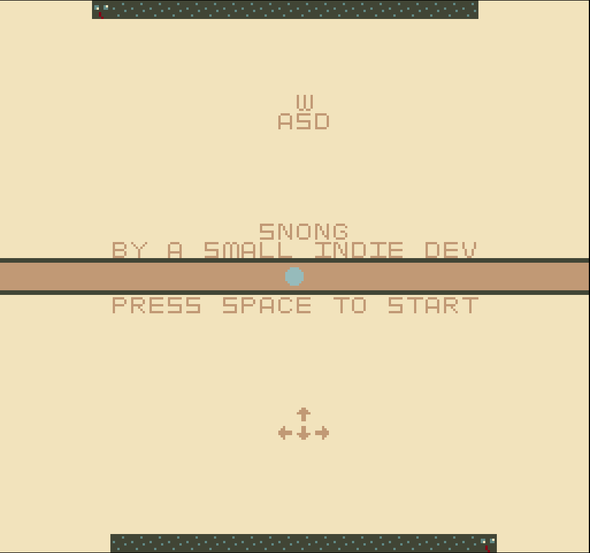

# Snong

**Author**: Joanna Yao

**Design**: Pong but instead of winning by hitting the ball into the opponent's side, you win by hitting ball with your snake to make the opponent's snake longer, so they can lose the snake game before you.

**Screen Shot**:

**Asset Pipeline**:

`asset_converter.py` takes in 8x8 PNG files, each containing at most 4 colors, and create a color palette from it; it then maps each pixel to the index of the corresponding color in its palette, and writes the index and palette of each image to a separate binary file. 

Each binary file contains 32 bytes: 

- byte 1-8: 0th bit of color indices for row 8-1

- byte 9-16: 1st bit of color indices for row 8-1

- byte 17-20, 21-24, 25-28, 29-32: RGBA values of 1st, 2nd, 3rd, and 4th color in the palette

`PlayMode.cpp` reads data directly from the binary files at the start of the game, stores the tiles and palettes, and initializes objects in game using this information.

**How To Play**:

Press SPACE to start. WASD for player 1 (top) and arrow keys for player 2 (bottom) to control the snake.

This game was built with [NEST](NEST.md).

